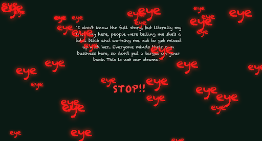

# 📓 Diary of a Normal Day

### *A text-and-sound diary about memory, judgment, and resilience*

**Chelsey Zhong**

---
**Diary of a Normal Day** is an interactive web diary that records experiences from a student who has been dealing with schooll bullying over a period of time.

---

## 🧠 Abstract

*Diary of a Normal Day* composed entirely of text and sound. Rather than presenting a single linear storyline, the project unfolds as a sequence of memories: opening a locker, walking through a cafeteria, overhearing comments, attempting to reach out, and noticing small signs of support.

By deliberately removing images, the work responds to the abstract nature of psychological experience, which resists fixed visual representation. This absence leaves room for interpretation, allowing each viewer to form their own emotional understanding through listening and reading. Sound, rhythm, and silence shape the experience, enabling internal responses，such as hesitation, self-doubt, and persistence, to surface alongside external moments.

---

Use headphones for the best experience.  
Move slowly. Listen carefully.
