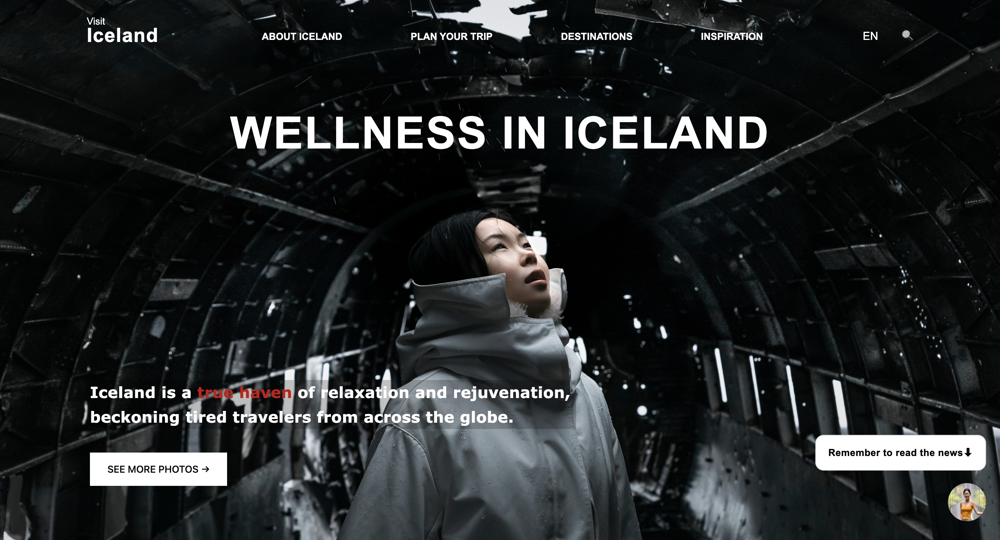
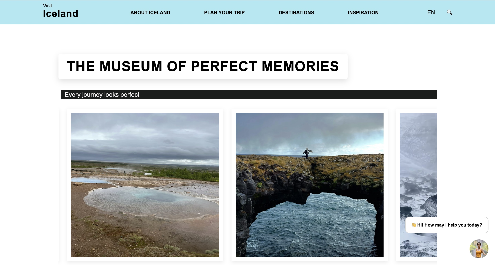
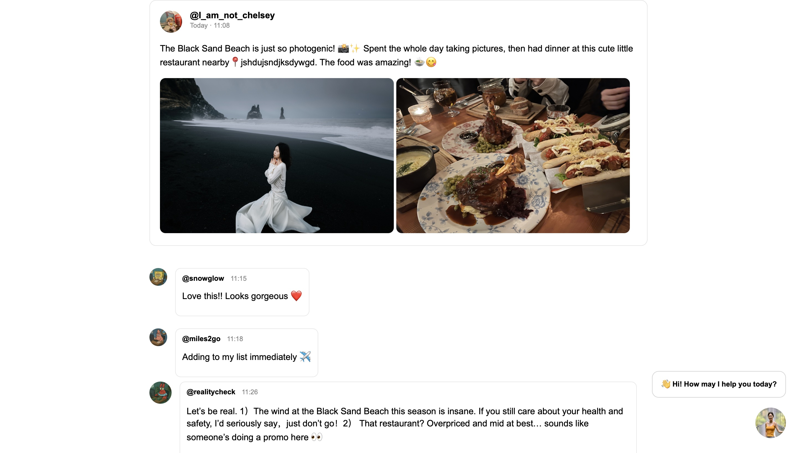

# 🌋 Visit Iceland Before It Melts 🫠 
### *A paradise so perfect, it must be fake. Is it?*  
🧊·🧊·🧊·🧊·🧊·🧊·🧊·🧊·🧊·🧊·🧊·🧊·🧊·🧊·🧊·🧊·🧊·🧊·🧊·🧊·
### 👩‍💻 Web Designer  
***I_am_not_Chelsey***

---
### 🧭 Description  
This website mimics Iceland’s official tourism page but twists it into a satire of curated travel media.  
Behind perfect photos and enthusiastic posts, it exposes the hidden chaos of weather, false expectations, and social-media illusions.

---

### 🧊 Abstract  
**The Real Iceland** reflects how media constructs a fantasy of “authentic experience” through design, photography, and language.  

By imitating the structure and tone of Iceland’s official travel site, the project reveals how travelers unknowingly perform this fantasy online by reposting idealized images even after disappointing experiences.  

Through interactive contradictions: beautiful layouts hiding fake comments, a chatbot that fails to help, and posts that flip between glamor and disaster, the website questions how digital aesthetics distort truth.  

Ultimately, the project is not about Iceland itself, but about how we all become part of the cycle: shaping and being shaped by the media we consume.

---
### 🖼️ Images  
|  |  |  |
|:--:|:--:|:--:|
| *Homepage — “Wellness in Iceland / Well...Less in Iceland”* | *A gallery of “perfect” travel photos hiding disappointing realities* | *Comment section chaos — paradise meets disaster* |

### 🌐 Try It Yourself  
👉 **[View the Project](https://cz2926-chelsey.github.io/CommLab/Shanzhai-Web/index.html)**  

---